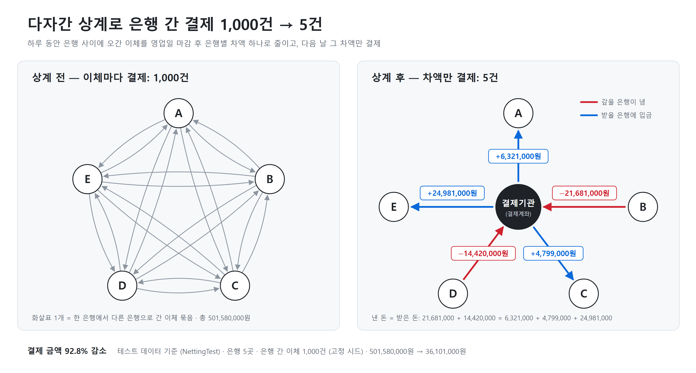
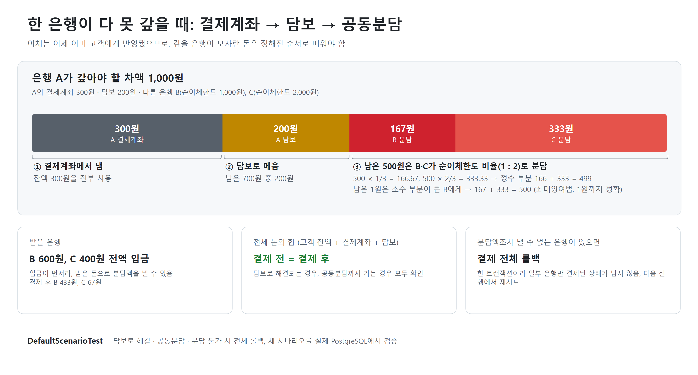
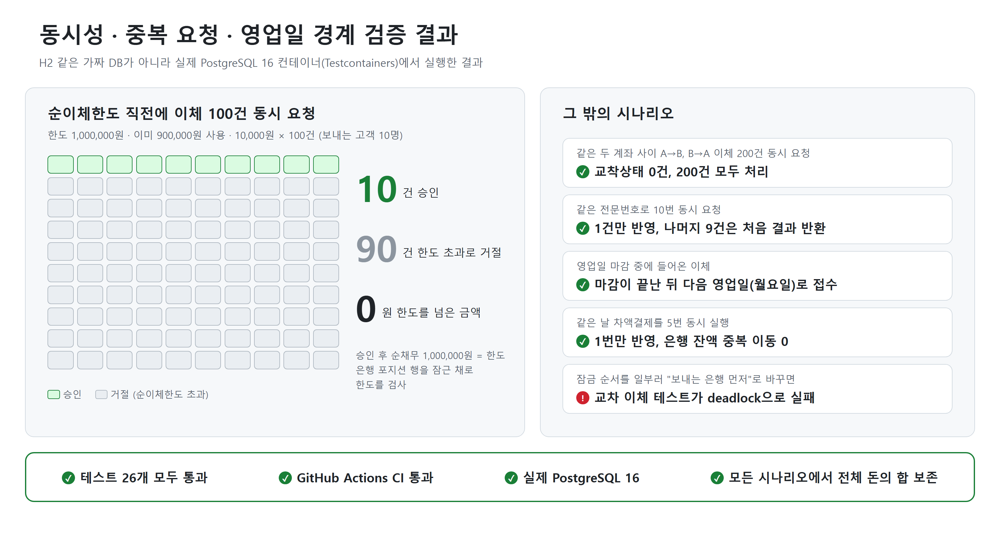

# 소액결제 차액결제 시뮬레이터

[](https://github.com/2Dokk/net-settlement-simulator/actions/workflows/ci.yml)

**이체는 즉시, 결제는 다음 날. 그 사이 한 은행이 무너져도 전체 돈의 합이 맞는지 테스트로 증명한 시뮬레이터.**

은행 공동망의 이연 차액결제(Deferred Net Settlement) 구조를 단순화해서 Spring Boot + PostgreSQL로 구현한
프로젝트입니다. 고객 이체는 바로 처리하고, 은행끼리는 하루치를 상계해서 다음 날 차액만 결제합니다. 이체와 결제
사이에 생기는 **시간차 위험**은 순이체한도, 담보, 공동분담으로 막습니다.





### 주요 결과

- 은행 5곳 사이의 이체 1,000건(501,580,000원)을 차액결제 5건(36,101,000원)으로 줄임 (`NettingTest`)
- 순이체한도 직전에 이체 100건을 동시에 보내도 정확히 10건만 승인
- 같은 두 계좌 사이 교차 이체 200건을 동시에 보내도 교착상태 없이 전부 처리
- 같은 전문번호 10번 동시 요청 중 1건만 반영, 같은 날 결제 5번 동시 실행 중 1번만 반영
- 담보로 해결되는 경우, 공동분담까지 가는 경우, 분담조차 못 해 롤백되는 경우 모두 전체 돈의 합 보존

> **단순화한 모델입니다.** 실제 은행 간 소액결제 차액결제 제도를 학습용으로 줄인 것이고, 아래 값들은 모두 가정입니다.
> - **순이체한도**: 은행 등록 시 정하는 고정 금액. 실제 산정 방식(자기자본 등)은 반영하지 않았습니다.
> - **담보**: 은행마다 고정 금액으로 맡겨 둔다고 가정. 실제 담보 비율·담보 종류는 반영하지 않았습니다.
> - **공동분담 비율**: 부족분이 생긴 은행을 뺀 **나머지 모든 참가 은행의 순이체한도 비율**로 나눕니다(그날 거래가 없던 은행도 포함).
> - 영업일 달력은 주말만 건너뜁니다(공휴일 없음). 금액은 원 단위 정수입니다.

## 흐름

```
 [영업일 D]                                   [D+1]
 고객 이체 ──▶ 고객 잔액 즉시 반영              차액결제 (한 트랜잭션)
          └──▶ 은행 포지션 누적                  ① 갚을 은행: 결제계좌 → 모자라면 담보
               (순채무 ≤ 순이체한도 검사)         ② 받을 은행: 차액 입금
 마감 ──▶ 다자간 상계 (차액 합 = 0 검증)          ③ 그래도 남은 부족분: 나머지 은행이 한도 비율로 분담
          다음 영업일 개시                       ④ 결제 회차 SETTLED
```

### ① 이체 접수 — `TransferService`

1. 열린 영업일 행에 **공유 잠금(FOR SHARE)** 을 잡고 영업일을 정합니다.
2. 전문번호로 `INSERT ... ON CONFLICT DO NOTHING`. 이미 있는 번호면 처음 결과를 그대로 돌려줍니다(멱등성).
3. 같은 은행 안의 이체면 포지션 없이 고객 계좌만 옮깁니다. 당행 이체는 공동망을 타지 않기 때문입니다.
4. 다른 은행 이체면 두 은행의 그날 포지션을 **은행 id 오름차순**으로 잠그고, `보낸 합계 − 받은 합계 + 이번 금액 > 순이체한도`면 거절합니다.
5. 통과하면 두 고객 계좌를 **계좌 id 오름차순**으로 잠그고 잔액 확인 후 반영, 포지션을 갱신합니다.

거절도 정상 결과라 행으로 남고(`REJECTED` + 사유), 같은 전문번호로 다시 보내도 같은 거절이 돌아옵니다.

### ② 마감 — `BusinessDayService.close`

열린 영업일 행을 **배타 잠금(FOR UPDATE)** 으로 잡고 CLOSED로 바꾼 뒤, 같은 트랜잭션에서 다음 영업일을 엽니다.
이체는 공유 잠금, 마감은 배타 잠금이라

- 마감은 **이미 진행 중인 이체가 모두 커밋할 때까지 기다립니다.** 마감된 날짜에 이체가 뒤늦게 섞이지 않습니다.
- 마감 중 들어온 이체는 마감이 끝날 때까지 기다렸다가, 깨어나서 다시 조회하면 **다음 영업일**을 잡습니다.

지정 시각 자동 마감은 `netsettle.cutoff-cron`(기본 평일 16:30), 자동 결제는 `netsettle.settlement-cron`(기본 평일 11:00)입니다.

### ③ 다자간 상계 — `NettingCalculator`

은행별 최종 차액 = `받은 합계 − 보낸 합계`. 모든 은행 간 이체는 한 은행의 보낸 합계와 다른 은행의 받은 합계를
같은 금액만큼 늘리므로 **차액의 합은 반드시 0**입니다. 0이 아니면 결제를 진행하지 않습니다.

### ④ 차액결제 — `SettlementService.settle`

결제 회차 행을 배타 잠금 → 모든 은행을 id 오름차순으로 잠금 → 다음을 **한 트랜잭션**에서 처리합니다.

| 단계 | 처리 |
|---|---|
| 갚기 | 차액이 음수인 은행이 결제계좌에서 냄. 모자라면 담보로 메움. 그래도 남으면 부족분(shortfall) |
| 입금 | 차액이 양수인 은행에 전액 입금 |
| 공동분담 | 부족분 합계를 나머지 은행이 순이체한도 비율로 원 단위까지 정확히 나눠 냄(최대잉여법, `LossAllocator`) |
| 검증 | 낸 돈(결제계좌+담보) = 받은 돈인지 확인 |
| 완료 | 결제 내역 저장, 회차 SETTLED |

분담액조차 낼 수 없는 은행이 있으면 `SettlementFailedException`으로 **결제 전체를 롤백**합니다. 일부 은행만
결제된 상태는 생기지 않고, 회차는 CLOSED로 남아 다음 실행에서 다시 시도합니다. 이미 SETTLED인 날짜를 다시
돌리면 아무것도 하지 않고 기존 결과만 돌려줍니다.

## 설계 결정과 이유

**왜 은행 id 순서로 잠갔나.** A→B 이체가 A, B 순으로, B→A 이체가 B, A 순으로 잠그면 서로 상대가 잡은 행을
기다리는 교착상태가 됩니다. 모든 경로가 `영업일 행 → 전문번호 → 은행 포지션(은행 id 순) → 고객 계좌(계좌 id 순)`의
같은 순서를 따르므로 대기 그래프에 순환이 생기지 않습니다. DVP 시뮬레이터에서 쓴 방식 그대로입니다.

**왜 전문번호로 중복을 막았나.** 네트워크 타임아웃 뒤 재전송된 요청은 처음 요청과 구별할 수 없습니다.
"이미 있는지 조회 → 없으면 저장"은 동시에 들어온 두 요청이 모두 "없음"을 볼 수 있어서, DB의 유일 제약에 맡겼습니다.
`ON CONFLICT DO NOTHING`은 같은 번호를 넣은 다른 트랜잭션이 끝날 때까지 기다렸다가 판단하므로 정확히 한 건만
처리됩니다. 같은 번호에 다른 내용(금액·계좌)이 오면 재전송이 아니라 번호 재사용이므로 409로 거부합니다.

**왜 배치를 한 트랜잭션으로 묶었나.** 은행별로 따로 커밋하면 중간 은행에서 실패했을 때 앞 은행들의 돈만 움직인
상태가 남습니다. 공동분담은 다른 은행의 결과(부족분 합계)에 따라 금액이 정해지므로 특히 부분 반영이 위험합니다.

### DVP 프로젝트에서 배운 것을 처음부터 반영

| DVP에서 겪은 문제 | 이번 설계 |
|---|---|
| 잠그기 전에 엔티티를 읽어서, JPA 1차 캐시가 잠근 뒤에도 **옛날 잔고**를 돌려줌 | 잠그기 전에는 id·값만 조회(`findBankIdById`, `findNetDebitLimitById`, `findOpenBusinessDate`). 엔티티는 **잠그면서 처음 읽음** |
| 참가자별 정산을 따로 커밋해, 중간 실패 시 **차액이 남음** | 차액결제 전체를 **한 트랜잭션**으로 설계. 실패하면 전부 롤백 |

## DVP와의 차이

| | DVP 증권결제 | 이 프로젝트 |
|---|---|---|
| 구조 | 증권과 대금을 **같은 순간**에 맞바꿈 | 고객 이체는 오늘, 은행 간 결제는 **내일** |
| 핵심 위험 | 한쪽만 이행되는 원금 위험 | 그 사이 한 은행이 못 갚는 **시간차(신용·유동성) 위험** |
| 막는 장치 | 원자적 트랜잭션 | 순이체한도 + 담보 + 공동분담 |

## 테스트로 증명한 것

모든 통합 테스트는 Testcontainers로 실제 PostgreSQL 16을 띄워서 돌립니다(H2 아님 — 행 잠금 동작이 다르기 때문).



| 테스트 | 증명하는 것 |
|---|---|
| `NetDebitLimitConcurrencyTest` | 한도 직전(900,000/1,000,000)에서 10,000원 이체 100건 동시 요청 → 정확히 10건 승인, 순채무가 한도를 넘지 않음 |
| `CrossTransferDeadlockTest` | 같은 두 계좌 사이 A→B, B→A 각 100건 동시 → 교착상태 없이 200건 모두 처리, 잔액·포지션 정확 |
| `IdempotencyTest` | 같은 전문번호 10번 동시 요청 → 1건만 반영. 거절된 전문의 재전송은 거절 그대로. 번호 재사용은 거부 |
| `CutoffTest` | 마감 중 들어온 이체 → 다음 영업일(주말 건너뜀)로 이동. 진행 중 이체가 끝나야 마감됨. 같은 날 두 번 마감은 무시 |
| `NettingTest` | 5개 은행 이체 1,000건 → 은행별 차액 합 = 0, 이체 테이블에서 따로 계산한 값과 일치, 결제 후 전체 돈의 합 보존 |
| `DefaultScenarioTest` | 담보로 해결되는 부족 / 공동분담까지 가는 부족(분담액 1:2 비율, 1원 단위까지) / 분담 불가 시 전체 롤백 — 모두 전체 돈의 합 보존 |
| `DoubleSettlementTest` | 같은 날 결제를 동시에 5번 → 1번만 반영 |
| `LossAllocatorTest` | 무작위 1,000회: 분담액 합 = 부족액, 각 분담액이 정확한 비율에서 1원 이내 |
| `SchedulerTest` | 크론을 매초로 켠 컨텍스트에서, 직접 호출 없이 스케줄러만으로 마감 → 차액결제가 일어남 |
| `ScheduleConfigTest` | 기본 크론이 평일 16:30 마감, 다음 영업일 11:00 결제로 도는지(금요일 마감 → 월요일 결제) |
| `ApiFlowTest` | HTTP로 은행 등록 → 이체(승인·재전송·번호 재사용 409·한도 초과) → 마감 → 상계 → 결제 → 재결제 |

테스트가 실제로 버그를 잡는지도 확인했습니다.
- 은행 포지션 잠금 순서를 "보내는 은행 먼저"로 일부러 바꾸면 `CrossTransferDeadlockTest`가 PostgreSQL `deadlock detected`로 실패합니다.
- 결제 크론을 끄면 `SchedulerTest`가 실패합니다.

**전체 돈의 합** = 고객 잔액 + 은행 결제계좌 + 담보. 공동분담액은 나머지 은행의 결제계좌·담보에서 받을 은행의
결제계좌로 옮겨지는 돈이라 이 합 안에 이미 들어 있습니다. 모든 시나리오에서 시작과 끝이 같은지 확인합니다.

## 실행

```bash
docker compose up -d     # PostgreSQL 16 (호스트 포트 5433)
./gradlew bootRun
```

테스트(Docker 필요):

```bash
./gradlew test
```

## API

| 메서드 | 경로 | 설명 |
|---|---|---|
| POST | `/banks` | 은행 등록 `{code, name, settlementBalance, netDebitLimit, collateral}` |
| GET | `/banks` | 은행 목록 + 현재 영업일 순채무 |
| POST | `/accounts` | 고객 계좌 개설 `{bankId, owner, openingBalance}` |
| GET | `/accounts/{id}` | 고객 계좌 조회 |
| POST | `/transfers` | 이체 `{messageNo, fromAccountId, toAccountId, amount}` → `status`(APPROVED/REJECTED), `replayed` |
| GET | `/transfers/{messageNo}` | 전문번호로 이체 조회 |
| GET | `/business-days/current` | 현재 열린 영업일 |
| POST | `/business-days/{date}/close` | 영업일 마감 |
| GET | `/settlements/{date}/netting` | 다자간 상계 결과 미리보기 |
| POST | `/settlements/{date}` | 차액결제 실행 |
| GET | `/settlements/{date}` | 차액결제 결과 |

거절된 이체도 정상 처리 결과라 200으로 돌려주고 `status`로 구분합니다. Windows 명령줄에서 curl로 한글 본문을
보내면 CP949로 바뀌어 들어가므로, 본문은 UTF-8 파일로 보내세요(`curl --data-binary @body.json ...`).

## 기술 스택

Java 21, Spring Boot 3.3, Spring Data JPA, PostgreSQL 16, Flyway, Testcontainers, GitHub Actions
